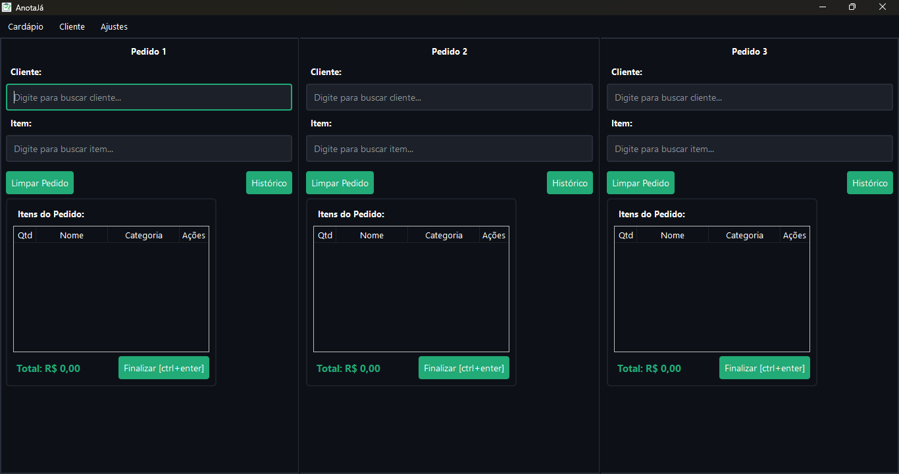
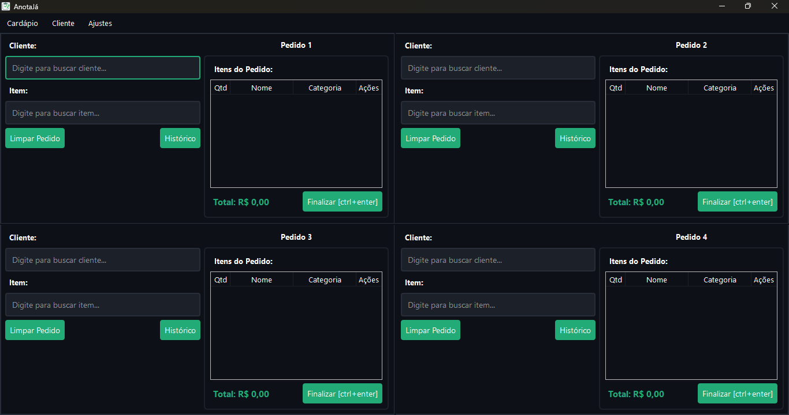
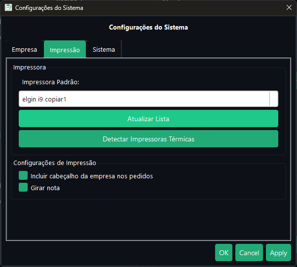
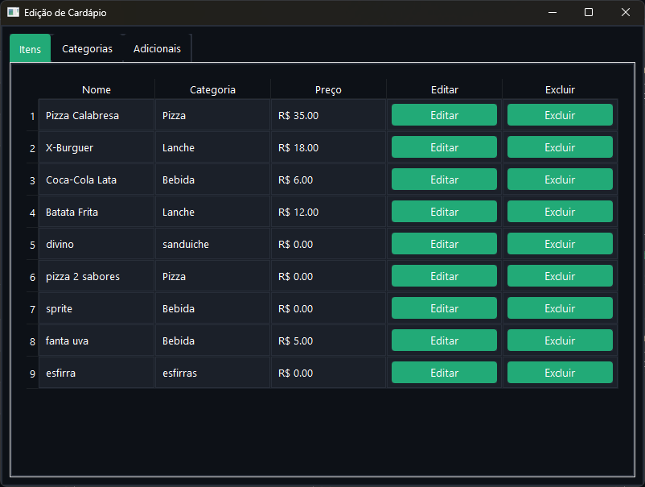

# AnotaJá

AnotaJá é um sistema de gestão de pedidos e clientes, desenvolvido em Python, com interface gráfica, focado em facilitar o controle de vendas, cadastro de clientes e gerenciamento de pedidos para pequenos negócios.

## Funcionalidades
- Cadastro e gerenciamento de clientes
- Registro e edição de pedidos
- Controle de produtos e cardápio
- Geração de relatórios
- Impressão de pedidos
- Interface intuitiva e fácil de usar

## Instalação
1. Clone este repositório:
   ```bash
   git clone https://github.com/vinicius342/AnotaJa.git
   ```
2. Crie e ative um ambiente virtual (recomendado):
   ```bash
   python -m venv venv
   .\venv\Scripts\activate
   ```
3. Instale as dependências:
   ```bash
   pip install -r requirements.txt
   ```

## Como usar
Execute o arquivo principal:
```bash
python3 main.py
```

## Estrutura do Projeto
- `main.py`: Arquivo principal para iniciar o sistema
- `ui/`: Interface gráfica e diálogos
- `database/`: Gerenciamento do banco de dados
- `utils/`: Utilitários e funções auxiliares
- `data/`: Dados e arquivos gerados
- `output/`: Arquivos de build e executáveis

## Prints da Interface





## Licença
Este projeto está licenciado sob a licença MIT. Veja o arquivo `LICENSE` para mais informações.

---
Desenvolvido por [vinicius342](https://github.com/vinicius342)
